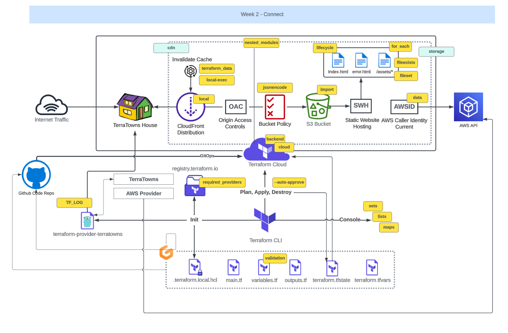
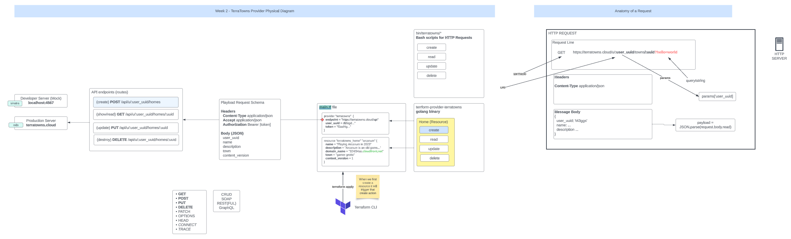

# Terraform Beginner Bootcamp 2023 - Week 2




- [Terraform Beginner Bootcamp 2023 - Week 2](#terraform-beginner-bootcamp-2023---week-2)
  - [Working with Ruby](#working-with-ruby)
    - [Bundler](#bundler)
      - [Installing Gems with Bundler](#installing-gems-with-bundler)
    - [Executing ruby scripts in the context of bundler](#executing-ruby-scripts-in-the-context-of-bundler)
    - [Sinatra](#sinatra)
  - [Terratowns Mock Server](#terratowns-mock-server)
    - [Running the Web Server](#running-the-web-server)
  - [CRUD Operations in Terraform Providers](#crud-operations-in-terraform-providers)
    - [Create](#create)
    - [Read](#read)
    - [Update](#update)
    - [Delete](#delete)


## Working with Ruby

Ruby is a dynamic, object-oriented programming language known for its simplicity and productivity. It's commonly used for web development, automation, and scripting. In this section, we'll explore some essential aspects of working with Ruby, including package management with Bundler and the Sinatra web framework.


### Bundler

Bundler is a package manager for ruby. It is the primary way to install ruby packages (know as gems) for ruby.

#### Installing Gems with Bundler

When working on Ruby projects, you often need to use external gems to add specific functionalities or libraries to your application. Bundler helps manage these gems and their dependencies, ensuring consistent environments across different machines.

To get started with Bundler:

1. Create a `Gemfile`: In your project's root directory, create a file named `Gemfile`. This file serves as a manifest for listing the gems your project depends on. You can define your project's gem requirements within this file.

    ```ruby
    # Gemfile

    source "https://rubygems.org"
    
    gem 'sinatra'
    gem 'rake'
    gem 'pry'
    gem 'puma'
    gem 'activerecord'
    ```

    Customize the list to include gems that suit your project's needs.

2. Install Gems: Open your terminal, navigate to your project's directory, and run the following command to install the specified gems:

    ```shell
    bundle install
    ```

    Bundler will download the gems listed in your `Gemfile` and install them globally on your system. Unlike some other package managers, Ruby gems are not installed in a local directory within your project.

    The installed gems will be available for use in your Ruby project.

3. Gemfile.lock: During the installation process, Bundler will generate a `Gemfile.lock` file. This file records the specific versions of gems used in your project. It helps ensure that the same gem versions are used consistently across different environments, preventing unexpected changes in gem versions.

    Make sure to commit the `Gemfile.lock` to your version control system (e.g., Git) to ensure that other team members or deployment environments use the exact same gem versions.


### Executing ruby scripts in the context of bundler

When running Ruby scripts that depend on gems managed by Bundler, use the `bundle exec` command before your script's command. This ensures that your script runs in the context of Bundler and uses the correct gem versions.

### Sinatra 

Sinatra is a micro web framework for Ruby used to build web applications. It's great for mock or development servers or for very simple projects. You can create a web server in a single file.

[More about Sinatra](https://sinatrarb.com/)

## Terratowns Mock Server

A Mock Server is a simulated server for development and testing. Replicates real server behavior without executing functions. Used for development isolation, testing, API development, offline work, and contract testing. Customizable and streamlines processes.

### Running the Web Server

To run the Terratowns Mock Server, execute the following commands in your terminal:

```shell
bundle install
bundle exec ruby server.rb
```

All of the code for our server is stored in the `server.rb` file.

## CRUD Operations in Terraform Providers



Terraform Providers facilitate essential CRUD operations, representing Create, Read, Update, and Delete. These operations are fundamental for resource management using Terraform Providers.

### Create

**Create**: In Terraform Providers, you define new resources in your configuration to create them. This involves specifying the resource type and its properties. When you apply your Terraform configuration, Terraform ensures the resource is created in your target infrastructure, maintaining the desired state.

### Read

**Read**: The **Read** operation allows you to query existing resources' current state without making changes. You can inspect attributes, properties, or metadata of resources using Terraform's `data` blocks, ensuring you have access to real-time information.

### Update

**Update**: To modify existing resources, you update their properties or attributes within your Terraform Provider configuration. When you apply these changes, Terraform identifies differences between the desired and current states, automatically applying updates to align with your configuration.

### Delete

**Delete**: When resources are no longer needed, you remove them from your Terraform Provider configuration. Applying this change prompts Terraform to recognize the resource's deletion, taking appropriate actions to remove it from the target infrastructure.

These operations empower you to automate resource provisioning and management effectively within your Terraform Provider configurations.


https://en.wikipedia.org/wiki/Create,_read,_update_and_delete